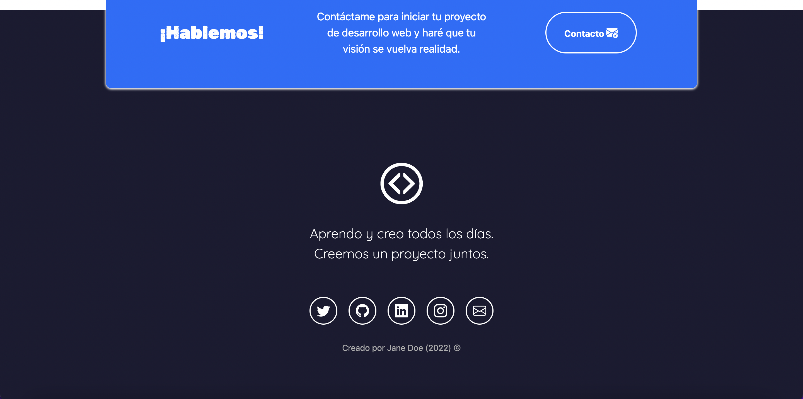

# Portafolio Adaptable (Responsive) con Bootstrap 5 / Adaptable Portfolio (Responsive) with Bootstrap 5 💻 

Este proyecto creado para el bootcamp Tecnolochicas PRO y rediseñado, es una página web adaptable a dispositivos de distintos tamaños (este tipo de sitio web se conoce en inglés como "responsive"). 
El propósito de esta página web es mostrar el portafolio de proyectos de un(a) desarrollador(a) y su experiencia. Incluye una descripción breve de su motivación, experiencia, proyectos, artículos publicados y formas de contacto. 
También incluye imágenes alternativas en la carpeta `imagenes` en caso de que se desee personalizar la imagen principal del desarrollador, además de animación a la escritura de la página web con JavaScript.

This project created for the Tecnolochicas PRO bootcamp and redesigned, is a web page adaptable to devices of different sizes (this type of website is known in English as "responsive").
The purpose of this web page is to show the portfolio of projects of a developer and his experience. It includes a brief description of your motivation, experience, projects, published articles and contact forms.
It also includes alternate images in the `images` folder in case you want to customize the developer's main image, as well as animation for writing the web page with JavaScript.

### Capturas de pantalla: 🖱️

Primera parte de la página web/ First part of the website :

Experiencia / Experience:

Proyectos/ Projects:

Testimonios / Testimonials:

Contacto:

## Tecnologías /Technologies 🤖

Esta página web fue creada con:

* HTML
* CSS
* JavaScript 
* Bootstrap 5

Además, se incluyeron **Google Fonts** para personalizar la fuente y **Bootstrap icons** para incorporar íconos como flechas y logos de redes sociales populares. 

## Español / Spanish ✅

El texto de la página web está escrito en español, al igual que las clases y atributos personalizados. Las clases relacionadas con Bootstrap se incluyeron en inglés.

